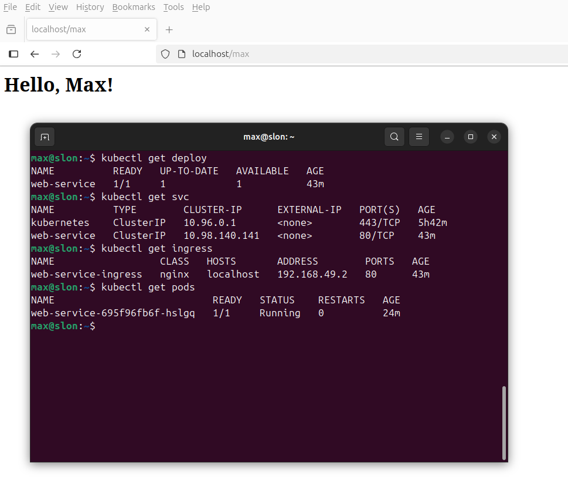
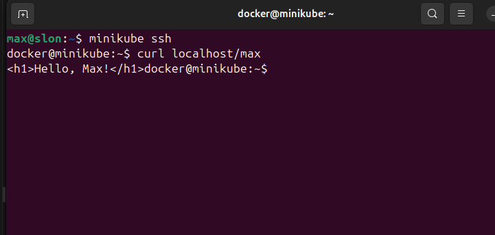
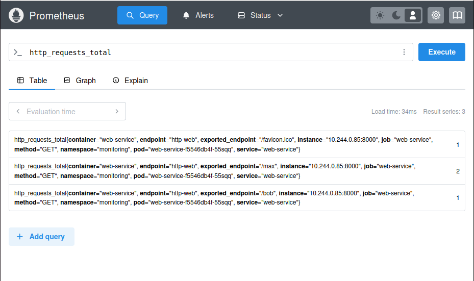
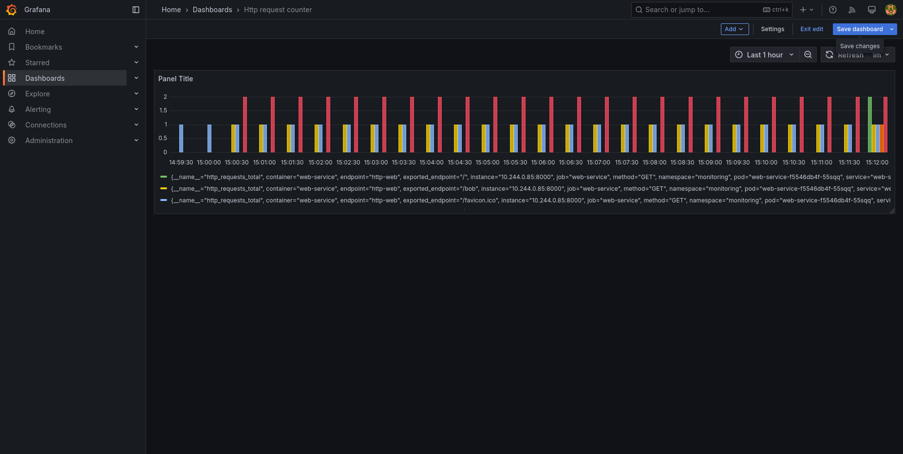
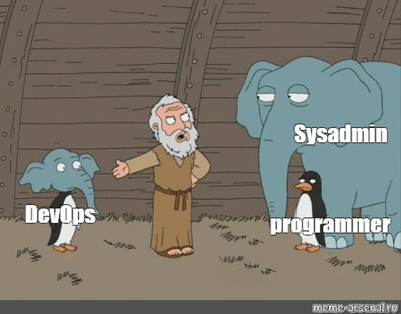

# Решение тестового задание

## Часть 1 - Развёртывание сервиса

### TL;DR
Быстрая инструкция для развёртывания сервиса на minikube:
```bash
minikube start 

docker build -t web-service .

minikube image load web-service:latest # если сбилдили на своей машине

minikube addons enable ingress

kubectl apply -f ./k8s/web-service.yml

minikube tunnel 
```

Потом открыть браузер http://localhost/твое-имя

### 1. Создание Docker-образа и веб-сервиса

**Dockerfile**
Первым шагом является создание Docker-образа для веб-сервиса, который будет развернут в Kubernetes. Для приложения понадобится *Python* и зависимости:
- *FastAPI* - фреймворк для создания веб-приложений
- *uvicorn* - ASGI сервер для запуска FastAPI-приложений.

```Dockerfile
FROM python:3.12-slim

WORKDIR /app

COPY requirements.txt .

RUN pip install --no-cache-dir -r requirements.txt

COPY main.py .

EXPOSE 8000

CMD ["uvicorn", "main:app", "--host", "0.0.0.0", "--port", "8000"]

```

**FastAPI сервис (пока без метрик)**
Инициализируем приложение и создаем корневой эндпоинт и эндпоинт, по которому возвращаеися "Hello, Name!".
```python
from fastapi import FastAPI, Request
from fastapi.responses import HTMLResponse

app = FastAPI()

@app.get("/", response_class=HTMLResponse)
async def read_root():
    return "<h1>Hello, stranger!</h1>"

@app.get("/{name}", response_class=HTMLResponse)
async def read_name(name: str):
    return f"<h1>Hello, {name.capitalize()}!</h1>"
```

**Сборка Docker-образа**
```bash
docker build -t web-service .
minikube image load web-service # отправляем образ со своей машины в миникуб кластер
```

### 2. Создание Kubernetes Deployment

Deployment управляет репликами нашего приложения, его масштабированием и обновлениями. Он определяет, какой образ использовать, как много реплик приложения запускать и как обновлять приложение без простоев.

```yml
apiVersion: apps/v1
kind: Deployment
metadata:
  name: web-service
spec:
  replicas: 1
  selector:
    matchLabels:
      app: web-service
  template:
    metadata:
      labels:
        app: web-service
    spec:
      containers:
      - name: web-service
        image: web-service
        ports:
        - containerPort: 8000 

```


### 3. Создание Kubernetes Service
Чтобы наши поды были доступны внутри кластера, нужно создать Service. Это позволяет другим компонентам Kubernetes обращаться к нашему приложению по имени.

```yml
apiVersion: v1
kind: Service
metadata:
  name: web-service
spec:
  selector:
    app: web-service # Cвязывает сервис с подами, у которых такая метка
  ports:
    - protocol: TCP
      port: 80         
      targetPort: 8000 

```


### 4. Настройка Ingress для внешнего доступа

Для того чтобы приложение было доступно извне кластера, настраиваем Ingress. Это контроллер, который позволяет проксировать HTTP(S) запросы внутрь кластера.


```yml
apiVersion: networking.k8s.io/v1
kind: Ingress
metadata:
  name: web-service-ingress
spec:
  rules:
  - host: localhost
    http:
      paths:
      - path: /
        pathType: Prefix
        backend:
          service:
            name: web-service
            port:
              number: 80
```

*host: localhost означает, что Kubernetes будет принимать запросы, поступающие на адрес localhost (т.е. на свой компьютер) и проксировать их внутрь кластера.*

### 5. Установка и настройка Ingress контроллера

Для того чтобы Ingress работал, нам нужно установить Ingress контроллер. В Kubernetes это специальный компонент, который будет обрабатывать запросы на основе конфигурации Ingress. Для этого мы используем один из популярных контроллеров — nginx-ingress.

**Установка**:

nginx-ingress можно установить через helm, но в minikube он идет по умолчанию, поэтмоу пишем:
```bash
minikube addons enable ingress # это nginx ingress controller
```

Теперь можно применить файл конфигурации Ingress
```bash
kubectl apply -f ingress.yaml
```

### 6. Открытие доступа через Minikube Tunnel
Для того чтобы запросы на localhost обрабатывались правильно, нужно настроить minikube tunnel, который откроет порты для доступа к сервисам в minikube через localhost.


```bash
minikube tunnel
```

### 7. Проверка работы сервиса

Теперь можно перейти в браузере на своей машине по пути:
http://localhost/твое-имя.

**Proof of Concept**



## Часть 2 — Мониторинг
### 1. Модифицированный веб-сервис
Воспользуемся библиотекой prometheus_client. В ней есть метрика-счетчик Counter. Она подходит для подсчета http запросов.

Также создадим middlware, который будет перехватывать все запросы, до их обработки эндпоинтами. Исключим из подсчета /metrics, так как это "cистемный" эндпоинт.

```python
from fastapi import FastAPI, Request
from fastapi.responses import HTMLResponse, PlainTextResponse
from prometheus_client import Counter, generate_latest

app = FastAPI()

REQUEST_COUNTER = Counter(
    'http_requests_total',
    'Total HTTP requests',
    ['method', 'endpoint']
)

@app.middleware("http")
async def count_requests(request: Request, call_next):
    if request.url.path == "/metrics":
        return await call_next(request)
        
    REQUEST_COUNTER.labels(
        method=request.method,
        endpoint=request.url.path
    ).inc()
    
    return await call_next(request)

@app.get("/metrics", response_class=PlainTextResponse)
async def metrics():
    return generate_latest()

@app.get("/", response_class=HTMLResponse)
async def read_root():
    return "<h1>Hello, stranger!</h1>"

@app.get("/{name}", response_class=HTMLResponse)
async def read_name(name: str):
    return f"<h1>Hello, {name.capitalize()}!</h1>"
```

### 2. Prometheus и Grafana

Создадим неймспейс
```bash
kubectl create namespace monitoring
```

Добавим репозиторий prometheus-community
```bash
helm repo add prometheus-community https://prometheus-community.github.io/helm-charts
helm repo update
```

Применим манифест с веб-сервисом:
```bash
kubectl apply -f web-service.yml
```

ServiceMonitor собирает метрики по эндпоинту */metrics* веб-сервиса, приминяем его манифест:

```bash
kubectl apply -f service-monitor.yml  
```

В Grafana нужно входить по логину и паролю. Воспользуемся kubernetes-secret. Напишем логин и пароль в grafana-secrets.yml и применим манифест:
```bash
kubectl apply -f grafana-secrets.yml
```

Воспользуемся чартом kube-prometheus-stack
```bash
helm install prometheus \
  prometheus-community/kube-prometheus-stack \
  --version 70.0.0 \
  -f monitoring-values.yml \
  --namespace monitoring
```
где monitoring-values.yml - переопределение некоторых параметров

Применяем minikube tunnel, если еще этого не сделали. Теперь Grafana доступна по адресу grafana.localhost.
Необходимо авторизироваться, использовав логин и пароль, который мы помещали в secrets.

**Proof of Concept**  
Для проверки прометеуса напрямую, небходимо временно пробросить порт, потому что prometheus в нашем случае не доступен из вне:
```bash
kubectl port-forward -n monitoring svc/prometheus-kube-prometheus-prometheus 9090:9090
```


Графана же доступна по адресу grafana.localhost:


## Что можно улучшить
- TLS для Ingress (Cert-Manager + Let's Encrypt)
- Ограничить доступ к /metrics из вне
- Ограничить ресурсы для всех микросервисов (сpu, memory)
- Выбрать хранилище получше для Prometheus

## Конец

